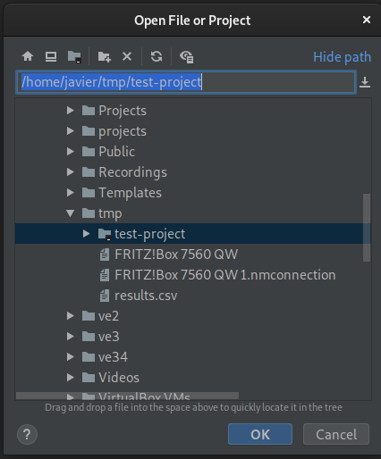
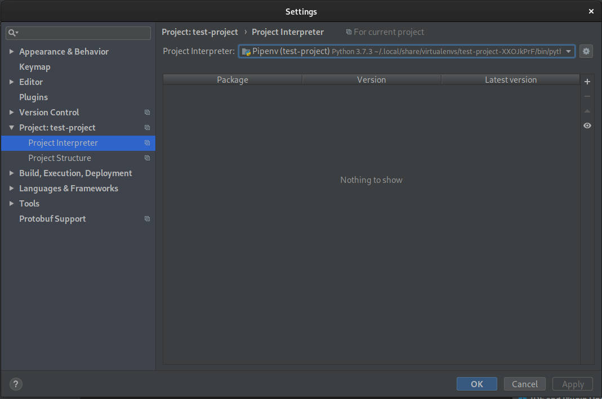
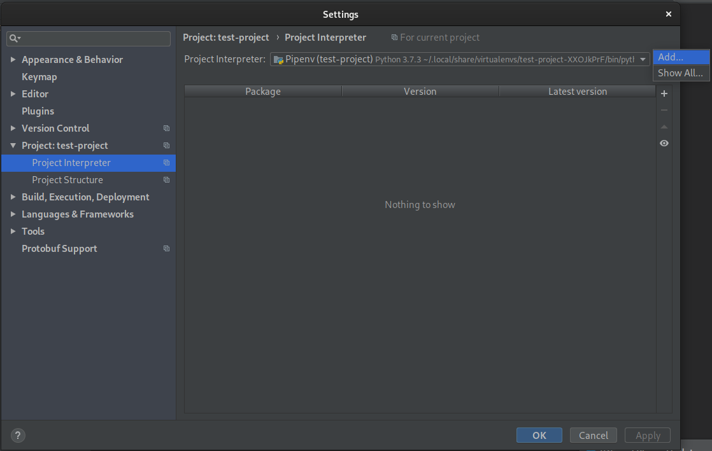
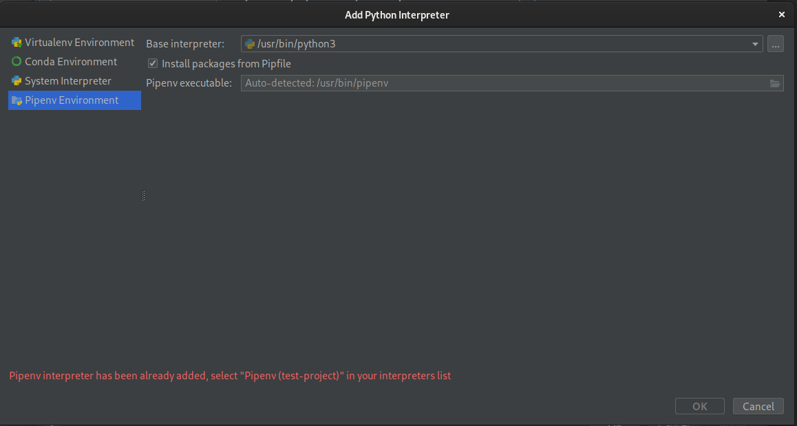
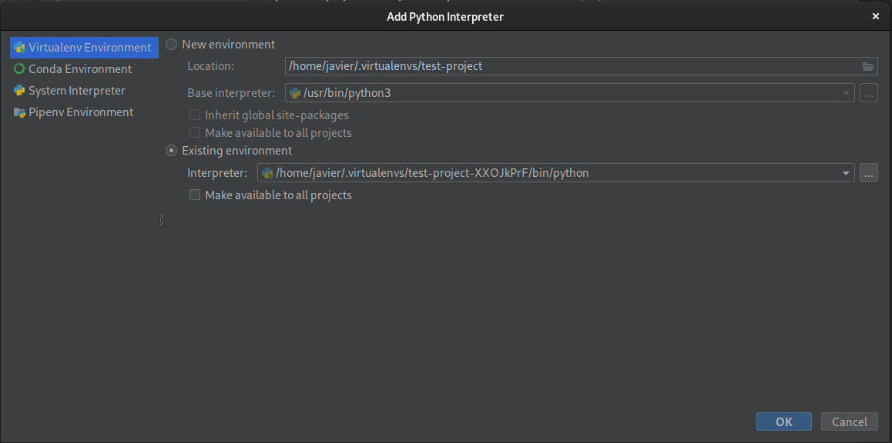
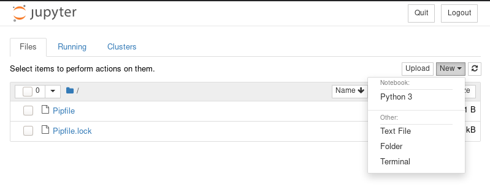
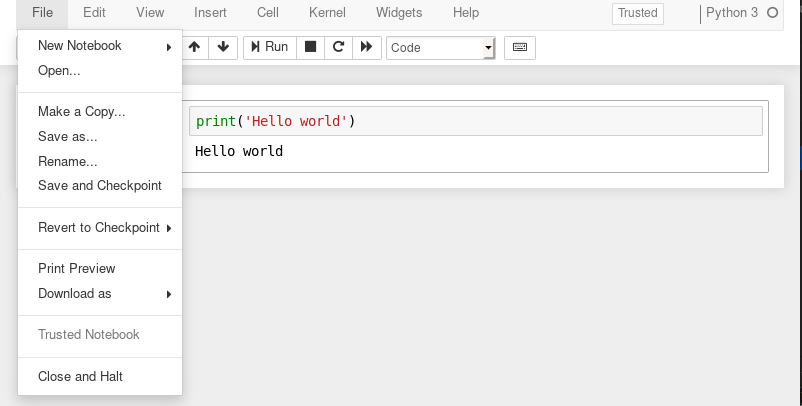
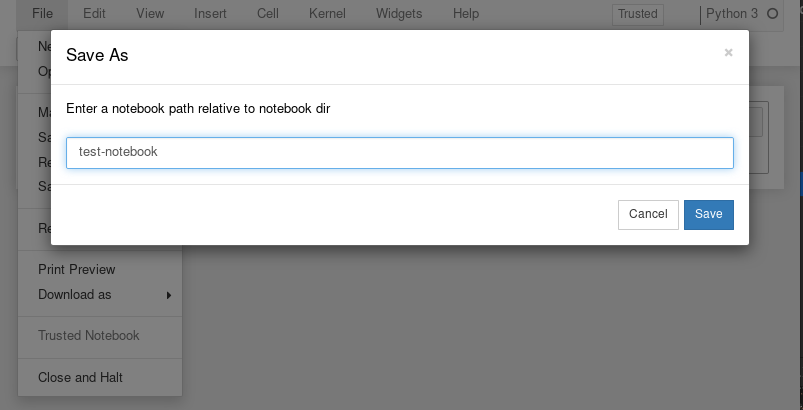
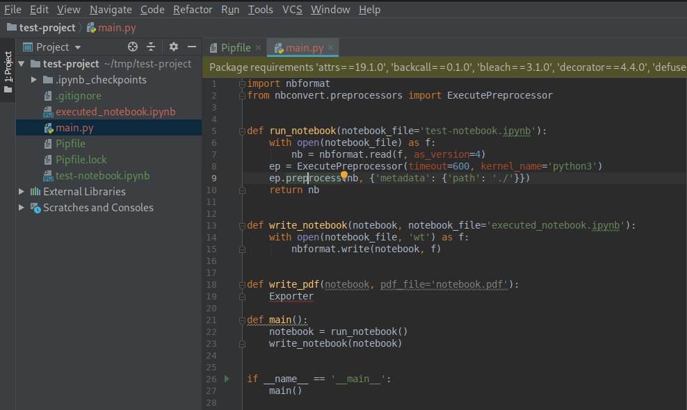
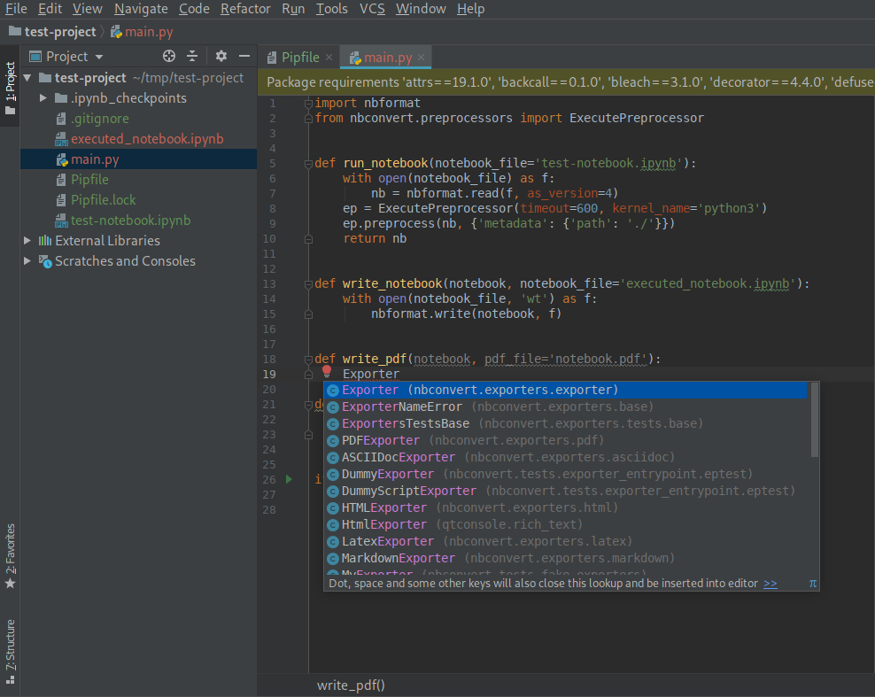

# Python Tutorial with Git, Gitlab-CI, Cloudbuild-CI, Docker, Gcloud

- [Python Tutorial with Git, Gitlab-CI, Cloudbuild-CI, Docker, Gcloud](#python-tutorial-with-git-gitlab-ci-cloudbuild-ci-docker-gcloud)
  - [FAQ: Why would I want to read this?](#faq-why-would-i-want-to-read-this)
  - [FAQ: What are we going to be doing here?](#faq-what-are-we-going-to-be-doing-here)
  - [Understanding the PYTHONPATH](#understanding-the-pythonpath)
  - [Understanding the global environment](#understanding-the-global-environment)
    - [Script directory or current directory](#script-directory-or-current-directory)
    - [Core Python installation](#core-python-installation)
    - [Site packages](#site-packages)
    - [(Advanced) Compiled modules](#advanced-compiled-modules)
    - [(Advanced) Zip Python core installation](#advanced-zip-python-core-installation)
  - [About directories and code organisation](#about-directories-and-code-organisation)
  - [Understanding a virtual environment](#understanding-a-virtual-environment)
    - [Installing Pipenv](#installing-pipenv)
    - [Creating a virtual environment with Pipenv](#creating-a-virtual-environment-with-pipenv)
    - [Virtualenv paths](#virtualenv-paths)
  - [Creating a Python project](#creating-a-python-project)
    - [Opening a directory as a project with PyCharm](#opening-a-directory-as-a-project-with-pycharm)
      - [(Advanced) Selecting external virtualenv](#advanced-selecting-external-virtualenv)
    - [Planning our work](#planning-our-work)
      - [Searching in Google what we want to do](#searching-in-google-what-we-want-to-do)
      - [Installing jupyter notebook as a dependency](#installing-jupyter-notebook-as-a-dependency)
      - [Create quick mock notebook](#create-quick-mock-notebook)
    - [Initializing a git repository](#initializing-a-git-repository)
      - [Setting up git](#setting-up-git)
    - [Adding initial files to git](#adding-initial-files-to-git)
  - [Coding our first script](#coding-our-first-script)
    - [Getting informed about how to use the API](#getting-informed-about-how-to-use-the-api)
    - [Structuring the code](#structuring-the-code)
    - [Running the initial script](#running-the-initial-script)
    - [Using the IDE and exploring other packages](#using-the-ide-and-exploring-other-packages)
    - [Dependencies of the code on external tools](#dependencies-of-the-code-on-external-tools)
    - [Saving the work](#saving-the-work)
    - [Project status so far](#project-status-so-far)
  - [From script to packaged cli application](#from-script-to-packaged-cli-application)
    - [From script to package](#from-script-to-package)
      - [Running packages directly with Python](#running-packages-directly-with-python)
      - [Packaging projects](#packaging-projects)
      - [Creating a command](#creating-a-command)
      - [Adding some Google Cloud Platform integration](#adding-some-google-cloud-platform-integration)
      - [Pip installations](#pip-installations)
        - [Word of advice on running `setup.py` directly](#word-of-advice-on-running-setuppy-directly)
    - [Parsing arguments](#parsing-arguments)
  - [Setting up gcloud SDK](#setting-up-gcloud-sdk)

---

Disclaimer: I have simplified and overlooked details in this guide.

This tutorial assumes you have read the [Python101 slides](https://docs.google.com/presentation/d/1WdBEU1BSDfEKHkLxY2IksiaAqXJBSKPUc_0Q4UJAtIY/edit):

- Python 3 is properly installed
- There are no other tools interfering with the Python setup
- Steps that require admin permission will be explicitly marked.

Limitations of the tutorial:

- Because on how Python is setup, we will be limited to running one Python 2 version and one Python 3 version.
  - After finishing this tutorial, if running several Python 3 versions is required, I recommend to have a look on [pyenv](https://github.com/pyenv/pyenv)
  - If running windows, I'm afraid you will need to resort to conda.
- After thinking about it for a good while, I don't want to explain everything from the very beginning. If in doubt, I try to follow the Zen of Python:

```text
[I] (test-project) javier@sam ~/t/test-project (master)> python -c 'import this'
The Zen of Python, by Tim Peters

Beautiful is better than ugly.
Explicit is better than implicit.
Simple is better than complex.
Complex is better than complicated.
Flat is better than nested.
Sparse is better than dense.
Readability counts.
Special cases aren't special enough to break the rules.
Although practicality beats purity.
Errors should never pass silently.
Unless explicitly silenced.
In the face of ambiguity, refuse the temptation to guess.
There should be one-- and preferably only one --obvious way to do it.
Although that way may not be obvious at first unless you're Dutch.
Now is better than never.
Although never is often better than *right* now.
If the implementation is hard to explain, it's a bad idea.
If the implementation is easy to explain, it may be a good idea.
Namespaces are one honking great idea -- let's do more of those!
```

## FAQ: Why would I want to read this?

This guide will explain how Python works as an execution environment, where the different directories and files that matter sit, and what are good ways of working in Python.

The idea is that this knowledge will allow you to be confident that you won't be breaking your computer, and that you will understand how the different commands you run affect your installation.

## FAQ: What are we going to be doing here?

The sum-up: We are going to create an app that when executed, will run some analysis on data, generate a report using jupyter notebook, and upload it as a pdf to GS.

The overview of the whole process:

- Learn how Python works
- Use Git in a basic way
- Create and package a Python project
- Using a mix of modules and jupyter notebooks we will
  - Load the data and transform it with pandas
  - Visualize the data in the jupyter notebooks
  - Generate pdf reports out of the notebooks
  - Upload the jupyter notebook after run to Google Cloud Storage (GS)
- Containerize the project
- Setup CI/CD using gitlab-ci and GCP cloudbuild
- Schedule it with Airflow using the KubernetesPodOperator
- Send the pdf by email

## Understanding the PYTHONPATH

PYTHONPATH is usually interchangeably used as the environment variable that Python reads and whose values are added to the PYTHONPATH, and the final Python path that results of merging the defaults with the PYTHONPATH. The relationship can be expressed as, `PYTHONPATH = defaults + PYTHONPATH_environment_variable`. In this tutorial, we will mostly be referring to the final Python path that results from merging the defaults and the environment variable.

`import sys` will trigger a lookup in the PYTHONPATH, looking for a package or module with that name to import.

Our ability to import modules relies on this feature of Python. The PYTHONPATH is similar to the shell PATH variable.

In all the systems, the PATH variable marks where to look for binaries. Therefore, running `base64`, will look on all those places, and the first match will be the one executed.

In the case of Python, same thing happens with modules. Doing `import sys` will trigger the same behaviour of traversing accross the different paths looking for the `sys` package or module.

## Understanding the global environment

Default Python installations should be clean from any kind of external packages. The only packages I recommend to put in the global namespace are the ones to create virtual environments. More specifically, I use Pipenv, therefore the following output would be in the global environment because I ran `pip3 install pipenv` (but for linux)

```text
root@6c4b4dd258dd:/$ pip freeze
certifi==2019.3.9
pipenv==2018.11.26
virtualenv==16.4.3
virtualenv-clone==0.5.2
```

By default, `python` will use the global environment, which is installed along Python. When speaking about environment, I refer to the `site-packages` directory.

Python installation can be divided in 2:

- Packages that are part of the core of Python (such as `os`, `sys`, `time`)
- Packages that are external to the Python language project (such as `pipenv`, `virtualenv`, `numpy`)

When choosing where to install Python packages, the core of Python will be setup in the Python version directory, whereas the other packages that are not part of the core will be setup in the `site-packages` directory.

Example output of the environment:

```text
root@6c4b4dd258dd:/# python -c 'import sys;print("\n".join(sys.path))'

/usr/local/lib/python37.zip
/usr/local/lib/python3.7
/usr/local/lib/python3.7/lib-dynload
/usr/local/lib/python3.7/site-packages
```

As we can see in the printed paths, there are quite a few directories and files there. Let's have a look on them.

Although I'm going to explain what these directories contain, I have sorted the directories by relevance marking 2 of them as optional.

### Script directory or current directory

It may be difficult to realise, but that empty line at the beginning of the PYTHONPATH means current directory. Python will add the location of the Python script we execute to the PYTHONPATH automatically. Python inserting the script directory in the path causes a lot of confusion when using the path of an script inside a package.

Have a look at [https://github.com/txomon/python-paths](https://github.com/txomon/python-paths) for some examples

### Core Python installation

In this case `/usr/local/lib/python3.7` is the place where all Python is installed:

```text
root@6c4b4dd258dd:/# ls /usr/local/lib/python3.7/ | tail
datetime.py
...
os.py
...
sys.py
```

As we can see, the typical first level import modules are present there.

### Site packages

Site packages is the name of the directory where we store all Python packages and modules that are not developed and distributed by the Python organization together with Python.

In this case `/usr/local/lib/python3.7/site-packages` is the system site-packages directory.

As we can see, all the packages that were installed for Pipenv are available here:

```text
root@6c4b4dd258dd:/# ls /usr/local/lib/python3.7/site-packages/
README.txt                   pkg_resources
__pycache__                  setuptools
certifi                      setuptools-40.8.0.dist-info
certifi-2019.3.9.dist-info   virtualenv-16.4.3.dist-info
clonevirtualenv.py           virtualenv.py
easy_install.py              virtualenv_clone-0.5.2.dist-info
pip                          virtualenv_support
pip-19.0.3.dist-info         wheel
pipenv                       wheel-0.33.1.dist-info
pipenv-2018.11.26.dist-info
```

Later we will probably dive-in into what are all those files there that don't look like Python modules (the ones that end in `.dist-info`). But for now let's just keep in mind that these files help Python keep track of the data of each package.

### (Advanced) Compiled modules

When we speak about compiled modules in Python, we usally can refer to Python byte-code or to dynamic libraries. In this specific case, we are referring to the later.

One of the ways to improve the performance of our Python programs is through the implementation in a low level language of some parts of the routines that require performance. One of the most common ones are C and C++.

Python has an API to create our own Python modules coded in C, so that we can import those modules from normal Python scripts, however running in the low level implementation we coded.

```text
root@6c4b4dd258dd:/# ls /usr/local/lib/python3.7/lib-dynload/ | head
_asyncio.cpython-37m-x86_64-linux-gnu.so
_bisect.cpython-37m-x86_64-linux-gnu.so
_blake2.cpython-37m-x86_64-linux-gnu.so
_bz2.cpython-37m-x86_64-linux-gnu.so
_codecs_cn.cpython-37m-x86_64-linux-gnu.so
_codecs_hk.cpython-37m-x86_64-linux-gnu.so
_codecs_iso2022.cpython-37m-x86_64-linux-gnu.so
_codecs_jp.cpython-37m-x86_64-linux-gnu.so
_codecs_kr.cpython-37m-x86_64-linux-gnu.so
_codecs_tw.cpython-37m-x86_64-linux-gnu.so
```

Here, we can see in the list asyncio module's low level implementation.

### (Advanced) Zip Python core installation

Python supports distributing the sourcecode in zipfiles. This is a feature to ease distribution, but it's really easy to get wrong if not careful, and moreover, zipfile distribution makes only sense for big packages (such as protobuf generated code).

Zipped Python packaging is outside the scope of this guide, but feel free to read about it at [PEP-273](https://www.python.org/dev/peps/pep-0273/)

## About directories and code organisation

Before starting off with the first project, I would consider a few things that usually developer come across on their own:

- Spaces in the names of directories and files at any point are forbidden. Spaces cause a ton of trouble and we end up paying the price way later when changing paths it's practically impossible.
- Create a directory to hold all our code. Having code projects in the desktop is handy, but code ends up getting mixed with downloads and what not, and that gets unmanageable quickly. Here there are a few approaches to organize cour coding projects:
  - Directory in the root called "projects" or "code" (`/projects/`)
  - Directory in HOME (`/home/javier/projects/`), supposing the path doesn't contain any space, called "projects" or "code"
  - Same thing as before, but organising the code in subdirectories (per project for example)

## Understanding a virtual environment

We have explained how Python looks up packages and modules, and we have seen how the global Python installation is organized.

This may not be an obvious thing, but in software development, dependencies are many times a big headache. There are many ways in which the different languages sort out and use dependencies. In Python, we try to separate each application to run with its own environment. These is achieved by modifying of the PYTHONPATH and virtual environments.

A virtual environment to put it simple is just a new location that is inserted earlier in the path than the global system installation discussed earlier.

### Installing Pipenv

Although I have said it implicitly, from this part on we will need to have Pipenv installed. To do so, with no virtualenv activated and admin privileges run `pip install pipenv`.

If using linux, your distribution probably has packaged Pipenv as `python-pipenv` or something similar. In OSX, I would discourage installing Python packages through brew, it works somewhat weirdly, and we just want one package in the global `site-packages` + a binary in the bin directory.

### Creating a virtual environment with Pipenv

The main creation tool to create a virtual environment is `venv` or `virtualenv`. However, in our case we want to have a higher level abstraction over the functionalities of two tools.

Traditionally, on top of those two, we can find `virtualenv-wrapper`, which takes care of the location. In our case, we are going to use Pipenv because besides the aforementioned functionalities, Pipenv gives a few nice extras around dependency management.

At the beginning of the guide I showed how I only have globally installed a few packages. These are all Pipenv and its dependencies. I do not recommend installing  Pipenv from brew.

Additionally, this guide will only use Pipenv, not show how to use it. The full documentation is available in [the official documentation page](https://pipenv.readthedocs.io/en/latest/)

We will create virtual environments using `pipenv shell`, which will launch a new shell with the environment activated.

```text
root@c88f7f192fde:~# mkdir test-project
root@c88f7f192fde:~# cd test-project/
root@c88f7f192fde:~/test-project# pipenv shell
Creating a virtualenv for this project…
Pipfile: /root/test-project/Pipfile
Using /usr/local/bin/python (3.7.3) to create virtualenv…
⠧ Creating virtual environment...Already using interpreter /usr/local/bin/python
Using base prefix '/usr/local'
New python executable in /root/.local/share/virtualenvs/test-project-Ph4xz48u/bin/python
Installing setuptools, pip, wheel...
done.

✔ Successfully created virtual environment!
Virtualenv location: /root/.local/share/virtualenvs/test-project-Ph4xz48u
Creating a Pipfile for this project…
Launching subshell in virtual environment…
in/activate192fde:~/test-project#  . /root/.local/share/virtualenvs/test-project-Ph4xz48u/bi
(test-project) root@c88f7f192fde:~/test-project#
```

### Virtualenv paths

We know we have a virtual environment activated because there are those parenthesis at the beginning of the shell line `(test-project)`.

Also, if we run the same command as before, we will see that the PYTHONPATH has been modified

```text
(test-project) root@c88f7f192fde:~/test-project# python -c 'import sys;print("\n".join(sys.path))'

/root/.local/share/virtualenvs/test-project-Ph4xz48u/lib/python37.zip
/root/.local/share/virtualenvs/test-project-Ph4xz48u/lib/python3.7
/root/.local/share/virtualenvs/test-project-Ph4xz48u/lib/python3.7/lib-dynload
/usr/local/lib/python3.7
/root/.local/share/virtualenvs/test-project-Ph4xz48u/lib/python3.7/site-packages
```

As before, we have the current directory the first, and we can see that besides the global Python installation, the global site-packages directory has dissappeared, and has been replaced by the one inside the virtualenv.

This way, we can have several virtual environments, with different packages and versions, where each virtual environment is installing the packages in its own `site-packages` directory.

Feel free to install new packages using Pipenv, and check how the `site-packages` directory gets populated with new packages and modules.


## Creating a Python project

The first thing we do to create a Python project is to create a directory for the project. Recommendations on naming are the typical, use lowercase, dash separated names.

I like to do the key steps through the terminal, and I very much recommend learning how to do everything through the terminal before switching to some kind of interface.

```text
root@c88f7f192fde:~# mkdir test-project
root@c88f7f192fde:~# cd test-project/
```

Once inside, we can start a Pipenv environment, and head over to the IDE.

```text
root@c88f7f192fde:~/test-project# pipenv shell
Creating a virtualenv for this project…
Pipfile: /root/test-project/Pipfile
Using /usr/local/bin/python (3.7.3) to create virtualenv…
⠧ Creating virtual environment...Already using interpreter /usr/local/bin/python
Using base prefix '/usr/local'
New python executable in /root/.local/share/virtualenvs/test-project-Ph4xz48u/bin/python
Installing setuptools, pip, wheel...
done.

✔ Successfully created virtual environment!
Virtualenv location: /root/.local/share/virtualenvs/test-project-Ph4xz48u
Creating a Pipfile for this project…
Launching subshell in virtual environment…
in/activate192fde:~/test-project#  . /root/.local/share/virtualenvs/test-project-Ph4xz48u/bi
(test-project) root@c88f7f192fde:~/test-project#
```

### Opening a directory as a project with PyCharm

We can now open the `test-project` directory with PyCharm. Depending on the setup, PyCharm may be available from the command line. But for sake of simplicity let's just assume we open it graphically.

It is really important to keep in mind that opening a file is not the same as opening a directory (AKA project). When we open a file with PyCharm, it's the same as opening the file with notepad++. It will colour the words, but it will not work as an IDE.

When we open a directory with PyCharm, it automatically tries to index all the contents of the directory, and generate autocomplete and other features. In some cases it will autodetect the virtual environment, and link our imports to the real packages.



We will see that PyCharm automatically starts working and doing things (we can check this in the bottom status bar, on the right side)

The first thing to do when we open a new directory with PyCharm is to check what is the Python interpreter is using. PyCharm calls it Python interpreter as a way to group a virtualenv, remote Python installations and the global local installation.

To setup the Python interpreter, we can head to `Settings -> Project: project-name -> Project Interpreter`



Depending on our luck (because many times is really about luck), PyCharm will automatically detect the virtualenv Pipenv created (we know if it's the one we want by reading in the dropdown box where it says `Project Interpreter`). If the virtual environment , or if we are not using Pipenv, we may need to select it ourselves.

For this, there is an small wheel icon on the right side of the `Project interpreter` dropdown box. Click it and choose `Add`.



This will pop up a new window that will give us all those options I mentioned before.

In our specific case, we will always head to the section `Pipenv Environment`.

There, we will pick the global Python as `Base interpreter`, In my case `/usr/bin/python3`. Please make sure to specify the major version of Python here, don't use `python` but rather `python3` or `python2`.

If this is selected, or if we see a red message like the one in the screenshot, we click OK (if possible) or Cancel, meaning that the setup was already done.



#### (Advanced) Selecting external virtualenv

If we were adding a virtualenv that is not through Pipenv, would head to the first section, `Virtualenv Environment`, and pick the virtualenv from either the list, or browsing to `~/.virtualenvs/projectname-xxxxx`.



### Planning our work

There are steps that can be done out of order, and we could create if we wanted all the scaffolding of the project first, but I just hate overcomplicating things from the beginning, and I don't want to do it now.

I always start coding in a single script file that I call `main.py`, and for now, we will be coding everything there.

The first piece of work we want to do is to run a jupyter notebook and generate a pdf out of it. For this, we just go on our favourite search engine and see any prior art.

#### Searching in Google what we want to do

The first thing I do is to look for `run jupyter notebook and generate pdf` in google. This brings me to a [StackOverflow question where a asks how to convert an .ipynb format into html and pdf](https://stackoverflow.com/questions/15998491/how-to-convert-ipython-notebooks-to-pdf-and-html/25942111). Looking at the updated answer, it seems like the answer is a bit outdated, but it points us in the right direction, `jupyter nbconvert` is a tool done by the guys that maintain `jupyter notebook`.

Therefore, the next search is `jupyter nbconvert`. The first result is [the github repository (for me)](https://github.com/jupyter/nbconvert), which in the title has a link to [the documentation](https://nbconvert.readthedocs.io/en/latest/).

We still don't have clear if `jupyter nbconvert` will only allow us to convert the jupyter notebooks to pdf or if it will also allow us to run the notebooks. However, [it does seem like nbconvert supports being used as a library](https://nbconvert.readthedocs.io/en/latest/nbconvert_library.html), which would allow us to do the conversion from code and avoid having to create an script to orchestrate everything.

If we continue looking on the TOC on the left, we can see a suggestive title [Executing notebooks](https://nbconvert.readthedocs.io/en/latest/execute_api.html), which after clicking on it shows us a usage example of how to execute a notebook from code.

With all this, it seems like we can indeed write code that will execute the notebook, and generate a pdf without writing any of the logic to do it ourselves!

Now we just need to code the glue to make it happen.

#### Installing jupyter notebook as a dependency

Let's start by adding jupyter notebook as a dependency. This can be done with `pipenv install jupyter[all]`. The brackets are special pip syntax to specify extras. Extras are meant to enable non-core functionality by installing some optional dependencies. In Python projects, people will often mention things like "Install pdf extras to get pdf printing functionality"

```text
[I] (test-project) javier@sam ~/t/test-project (master)> pipenv install jupyter[all]
Installing jupyter[all]…
Adding jupyter to Pipfile's [packages]…
✔ Installation Succeeded
Pipfile.lock not found, creating…
Locking [dev-packages] dependencies…
Locking [packages] dependencies…
✔ Success!
Updated Pipfile.lock (05691a)!
Installing dependencies from Pipfile.lock (05691a)…
  🐍   ▉▉▉▉▉▉▉▉▉▉▉▉▉▉▉▉▉▉▉▉▉▉▉▉▉▉▉▉▉▉▉▉ 43/43 — 00:00:07
```

#### Create quick mock notebook

Let's start the jupyter notebook server, and create a sample notebook.

```text
[I] (test-project) javier@sam ~/t/test-project (master)> jupyter notebook
[I 15:33:00.227 NotebookApp] Writing notebook server cookie secret to /run/user/1000/jupyter/notebook_cookie_secret
[I 15:33:01.164 NotebookApp] Serving notebooks from local directory: /home/javier/tmp/test-project
[I 15:33:01.164 NotebookApp] The Jupyter Notebook is running at:
[I 15:33:01.164 NotebookApp] http://localhost:8888/?token=f35dc86611e047db906947d7615187355879813abeba6a58
[I 15:33:01.164 NotebookApp] Use Control-C to stop this server and shut down all kernels (twice to skip confirmation).
[C 15:33:01.205 NotebookApp]

    To access the notebook, open this file in a browser:
        file:///run/user/1000/jupyter/nbserver-19259-open.html
    Or copy and paste one of these URLs:
        http://localhost:8888/?token=f35dc86611e047db906947d7615187355879813abeba6a58
```

This should open the jupyter notebook interface in your default browser (if it doesn't just click the link that appears in the console).

After it opens, let's just create a new Python 3 notebook



Then, we write some hello world code in it:

```python
print('Hello world')
```



And we save it as `test-notebook`, which will create the file `test-notebook.ipynb` in our directory.



For now, we don't need the jupyter notebook server anymore. We only care about the code. Let's exit the notebook with `ctrl-c` in the terminal, and confirm with `y`.

When working in a git repo, we won't usually do `ls` to check the files, we do `git status`, as we don't usually care about untracked files. Therefore, let move onto creating a git repo, as we start to have at least three files we care about.

### Initializing a git repository

Each project should run in it's own git repository. Having more than one project per git repository will give us infinite headaches in the future, so the recommendation is to avoid it by having everything cleanly separated.

To create a git repository, run `git init`

```text
[I] (test-project) javier@sam ~/t/test-project> git init
Initialized empty Git repository in /home/javier/tmp/test-project/.git/
```

Before continuing, let's setup git

#### Setting up git

There are two main things that I always setup when using git. First one is to make sure that my email is correct and my name is the same everywhere. Second one is to setup the global gitignore.

`.gitignore` is the file that is usually in the repository to ignore files, however, the `.gitignore` shipped in the repos should only ignore files that are a sideeffect of the project. **The fact that we use one editor or another should be unknown to the project**

The global gitignore is the file `~/.config/git/ignore`, if the directory doesn't exist, just create it with `mkdir -p ~/.config/git/`. The contents vary between different people.

In my case, these are the files that I ignore:

```text
[I] (test-project) javier@sam ~/t/test-project> cat ~/.config/git/ignore
/.idea/
/.vscode/
*.orig
*.new
```

I mainly use IntelliJ base IDEs (By JetBrains), and I'm starting to use Visual Studio Code (By Microsoft, but opensource) more lately. The other two lines refer to files when there is a git merge collision.

### Adding initial files to git

Once we have created the `test-notebook.ipynb` through the jupyter notebook, we have already something that we can start thinking about adding to the repo.

If we check `git status` it should show something like the following:

```text
[I] (test-project) javier@sam ~/t/test-project (master)> git status
On branch master

No commits yet

Changes to be committed:
  (use "git rm --cached <file>..." to unstage)

        new file:   Pipfile
        new file:   Pipfile.lock

Untracked files:
  (use "git add <file>..." to include in what will be committed)

        .ipynb_checkpoints/
        Untitled.ipynb
        test-notebook.ipynb
```

An extra notebook may have been created, or even some files added by PyCharm when a few pop-ups came to us and we clicked OK on them without reading.

In my case, I have a few things to clean up:

- I need to get rid of the `.ipynb_checkpoints/` directory, as after a quick search in google it seems some kind of side-effect of using jupyter notebook server.
- I need to delete `Untitled.ipynb` because I only need the `test-notebook.ipynb`

For the first one, adding the whole directory to `.gitignore` will do. The second one is just a normal remove.

```text
[I] (test-project) javier@sam ~/t/test-project (master)> echo '.ipynb_checkpoints/'>>.gitignore
[I] (test-project) javier@sam ~/t/test-project (master)> rm Untitled.ipynb
[I] (test-project) javier@sam ~/t/test-project (master)> git status
On branch master

No commits yet

Changes to be committed:
  (use "git rm --cached <file>..." to unstage)

        new file:   Pipfile
        new file:   Pipfile.lock

Untracked files:
  (use "git add <file>..." to include in what will be committed)

        .gitignore
        test-notebook.ipynb
```

Now, we can add all the files as they are. Usually I will add the files to `git` but nothing else, as I don't have any first version of the code I want to run.

```text
[I] (test-project) javier@sam ~/t/test-project (master)> git add .
[I] (test-project) javier@sam ~/t/test-project (master)> git status
On branch master

No commits yet

Changes to be committed:
  (use "git rm --cached <file>..." to unstage)

        new file:   .gitignore
        new file:   Pipfile
        new file:   Pipfile.lock
        new file:   test-notebook.ipynb

```

Everything looks ok, so let's proceed. Just in case you don't understand why I add but not commit, it's because I'm taking advantage of the staging area of git to save work without committing. Check the docs for more info.

## Coding our first script

We are finally ready to start the first script. We have all the stuff we need to test the code and some mock data to work on.

We can finally make use of the IDE and create a new Python script in the top. Notice that I am speaking about scripts, as opposed to modules. This is because on how I am planning to run it directly with python (`python main.py`).

### Getting informed about how to use the API

We have clear that there is an API that will allow us to do everything. Therefore, the best is to start off by reading the specific calls we need to do.

After reading for while, let's start with copying the code in the examples together in `main.py`. I have adapted the name of the input notebook filename and the path in which to execute the notebook at.

```python
import nbformat
from nbconvert.preprocessors import ExecutePreprocessor


with open(notebook_filename) as f:
    nb = nbformat.read(f, as_version=4)
ep = ExecutePreprocessor(timeout=600, kernel_name='python3')
ep.preprocess(nb, {'metadata': {'path': './notebooks'}})
with open('executed_notebook.ipynb', 'wt') as f:
    nbformat.write(nb, f)
```

This is literally a copy paste of all the stuff we can find in the documentation. To be honest, it's pure chance this tutorial is so straight forward, and it's probably the only time that it has happened to me.

There are a few things that need to be tweaked though, such as having `notebook_filename` defined with the name of our notebook, and changing the `metadata.path` value to be `./`.

### Structuring the code

Although we could run it like this, I would try not to go the script way for long. Let's structure the code we already have quite simply.

Tip: Learn the Hot Key for Reformat Code, in the top menu, `Code -> Reformat Code`, and run it often. It's extremely helpful!

```python
import nbformat
from nbconvert.preprocessors import ExecutePreprocessor


def run_notebook(notebook_file='test-notebook.ipynb'):
    with open(notebook_file) as f:
        nb = nbformat.read(f, as_version=4)
    ep = ExecutePreprocessor(timeout=600, kernel_name='python3')
    ep.preprocess(nb, {'metadata': {'path': './'}})
    return nb


def write_notebook(notebook, notebook_file='executed_notebook.ipynb'):
    with open(notebook_file, 'wt') as f:
        nbformat.write(notebook, f)


def main():
    notebook = run_notebook()
    write_notebook(notebook)


if __name__ == '__main__':
    main()
```

With this simple changes, we have:

- Packaged functionality in functions
- Set defaults so that we don't need to pass any arguments
- Made sure that our script works OK as a module

The `default arguments` are a thing in Python, and we are using them to provide those defaults I mentioned.

The script can be used as a module because there are no side effects. When you run `import main`, it will run all the code in the first level, as in that Python will define all the functions, but it won't run the functions themselves.

### Running the initial script

We are now ready to run the code.

```text
[I] (test-project) javier@sam ~/t/test-project (master)> python main.py
```

And no output. Of course, we didn't set up any output here. But let's see if it worked.

TODO: Explain ipynb internal format

```json
[I] (test-project) javier@sam ~/t/test-project (master)> cat executed_notebook.ipynb
{
 "cells": [
  {
   "cell_type": "code",
   "execution_count": 1,
   "metadata": {},
   "outputs": [
    {
     "name": "stdout",
     "output_type": "stream",
     "text": [
      "Hello world\n"
     ]
    }
   ],
   "source": [
    "print('Hello world')"
   ]
  }
 ],
 "metadata": {
  "kernelspec": {
   "display_name": "Python 3",
   "language": "python",
   "name": "python3"
  },
  "language_info": {
   "codemirror_mode": {
    "name": "ipython",
    "version": 3
   },
   "file_extension": ".py",
   "mimetype": "text/x-python",
   "name": "python",
   "nbconvert_exporter": "python",
   "pygments_lexer": "ipython3",
   "version": "3.7.3"
  }
 },
 "nbformat": 4,
 "nbformat_minor": 2
}
```

It seems it worked, but I'm afraid we can't really tell much from all this. If we do a diff with the initial notebook, we don't see any difference!

```text
[I] (test-project) javier@sam ~/t/test-project (master)> diff -u executed_notebook.ipynb test-notebook.ipynb
```

Let's change then the output of the notebook. The new code will look like this:

```python
import datetime
print('Hello world', datetime.datetime.utcnow().isoformat())
```

This should give us enough information to know when it run. Let's try again.
TODO: Explain what diff does

```text
[I] (test-project) javier@sam ~/t/test-project (master) [1]> python main.py
[I] (test-project) javier@sam ~/t/test-project (master)>
diff -u executed_notebook.ipynb test-notebook.ipynb
--- executed_notebook.ipynb     2019-04-11 21:09:29.897578695 +0200
+++ test-notebook.ipynb 2019-04-11 21:08:23.333905355 +0200
@@ -2,14 +2,14 @@
  "cells": [
   {
    "cell_type": "code",
-   "execution_count": 1,
+   "execution_count": 2,
    "metadata": {},
    "outputs": [
     {
      "name": "stdout",
      "output_type": "stream",
      "text": [
-      "Hello world 2019-04-11T19:09:29.084740\n"
+      "Hello world 2019-04-11T19:08:08.947446\n"
      ]
     }
    ],
```

Here we can see how the time is being outputted in UTC. If we run it again, we can see it's working.

Let's now work on the second part. Exporting it to PDF.

### Using the IDE and exploring other packages

One of the good things of having an IDE is the ability to navigate the code when in doubt on how to use it.

In this case, [from the documentation](https://nbconvert.readthedocs.io/en/latest/nbconvert_library.html#Quick-overview) we can see that `Exporter` is the Python class that allow us to export to different formats.

This means that if we find all the classes defined in all the libraries we depend on, we are bound to find one that exports to PDF.

[We could search in Google for the pdf exporter without having to dive in the code](https://www.google.com/search?q=nbconvert+pdf+exporter), but I want to showcase what some of the IDE's powers are, besides putting nice colours to the code.

In this case, let's try by writing a `write_pdf` function that given a notebook and a file name, exports the notebook to that filename as a pdf. On it for now, let's just write `Exporter` on it.

```python
def write_pdf(notebook, pdf_file='notebook.pdf'):
    Exporter
```

After writing it, we will probably see some red lines and complaints from PyCharm like the following image.



And now, get ready for the magic of an IDE. Remember how we said before that when opening a project it would index the files? This enables additional functionality that you wouldn't dream of in a text editor. And that's called Autocomplete with IntelliSense.

To trigger the autocompletion with steroids, do `ctrl-space` once (no autocompletion is suggested) (in Mac it may be `cmd-space`), and twice.



As you can see, PyCharm suggests as a bunch of objects he can find that have `Exporter` in their name. We can now use de arrows to navigate to `PDFExporter` and click enter.

This will do two changes to our code, which will make the red line dissappear.

- Where we wrote `Exporter` we will find `PDFExporter`
- On the top of the file, we will find a new import statement, `from nbconvert import PDFExporter`

This is all automatically done by PyCharm to help us developing.

There is one last thing that PyCharm enables as to do, and that's navigation. If you hold the `ctrl` key pressed, and click on `PDFExporter`, it will navigate to the file that defines `PDFExporter`.

This is extremely helpful in the situations where we have doubt on how exactly to use a function or a class, or what it does.

### Dependencies of the code on external tools

We can write the `write_pdf` function [after reading the documentation](https://nbconvert.readthedocs.io/en/latest/nbconvert_library.html#Quick-overview) on how to use the exporter. Also, let's update the main function too,

```python
def write_pdf(notebook, pdf_file='notebook.pdf'):
    pdf_exporter = PDFExporter()
    pdf_exporter.template_file = 'report'
    body, resources = pdf_exporter.from_notebook_node(notebook)
    with open(pdf_file, 'wb') as fd:
        fd.write(body)


def main():
    notebook = run_notebook()
    write_notebook(notebook)
    write_pdf(notebook)
```

If we now try to run the code, we will probably get the following output

```text
[I] (test-project) javier@sam ~/t/test-project (master)> python main.py
Traceback (most recent call last):
  File "main.py", line 34, in <module>
    main()
  File "main.py", line 30, in main
    write_pdf(notebook)
  File "main.py", line 22, in write_pdf
    body, resources = pdf_exporter.from_notebook_node(notebook)
  File "/home/javier/.local/share/virtualenvs/test-project-XXOJkPrF/lib/python3.7/site-packages/nbconvert/exporters/pdf.py", line 171, in from_notebook_node
    rc = self.run_latex(tex_file)
  File "/home/javier/.local/share/virtualenvs/test-project-XXOJkPrF/lib/python3.7/site-packages/nbconvert/exporters/pdf.py", line 143, in run_latex
    self.latex_count, log_error)
  File "/home/javier/.local/share/virtualenvs/test-project-XXOJkPrF/lib/python3.7/site-packages/nbconvert/exporters/pdf.py", line 105, in run_command
    "at {link}.".format(formatter=command_list[0], link=link))
OSError: xelatex not found on PATH, if you have not installed xelatex you may need to do so. Find further instructions at https://nbconvert.readthedocs.io/en/latest/install.html#installing-tex.
```

In general it's really important to read the text of the errors. Many times people before turning into writing Software will just ignore any error without looking them up or paying much attention. This is extremely common in Windows users because they are accustomed to unhelpful error messages. Please be careful and try to read through all the stuff that you come through when coding.

This exception is telling us that the tool `xelatex` is not in the system, and therefore it cannot proceed. This is because the pdf exporter depends on the latex exporter.

We could setup everything locally, but given that our code is just glue code and we first need to improve our base code, we will just ignore the pdf exporter for now, and move onto other more interesting steps. Let's remove the `make_pdf()` call from the `main()` function for now.

```python
def main():
    notebook = run_notebook()
    write_notebook(notebook)
```

### Saving the work

If we do a `git status` now, we will find something like the following:

```text
[I] (test-project) javier@sam ~/t/test-project (master) [1]> git status
On branch master

No commits yet

Changes to be committed:
  (use "git rm --cached <file>..." to unstage)

        new file:   .gitignore
        new file:   Pipfile
        new file:   Pipfile.lock
        new file:   test-notebook.ipynb

Changes not staged for commit:
  (use "git add <file>..." to update what will be committed)
  (use "git checkout -- <file>..." to discard changes in working directory)

        modified:   test-notebook.ipynb

Untracked files:
  (use "git add <file>..." to include in what will be committed)

        executed_notebook.ipynb
        main.py

```

We care about all the files but `executed_notebook.ipynb`, as it is a side-effect of our code. We could also argue that `test-notebook.ipynb` is not really needed, as our code doesn't depend on it. But I think we will be keeping it around as it is helpful to have some mock notebook to play with.

Given that `executed_notebook.ipynb` is a side-effect, let's ignore it by adding it to the `.gitignore` file inside the project, like so `echo 'executed_notebook.ipynb' >>.gitignore`.

If we run `git add .` we should now get the following `git status`:

```text
[I] (test-project) javier@sam ~/t/test-project (master)> echo 'executed_notebook.ipynb' >>.gitignore
[I] (test-project) javier@sam ~/t/test-project (master)> git add .
[I] (test-project) javier@sam ~/t/test-project (master)> git status
On branch master

No commits yet

Changes to be committed:
  (use "git rm --cached <file>..." to unstage)

        new file:   .gitignore
        new file:   Pipfile
        new file:   Pipfile.lock
        new file:   main.py
        new file:   test-notebook.ipynb

```

We are finally ready to save the changes for real. We can do so using `git commit`. Please take seriously writting commit messages.

Pro Tip: When writing commit messages, in your mind, try to complete the phrase `If this commit is applied, it will ...`.

```text
[I] (test-project) javier@sam ~/t/test-project (master)> git commit -am 'Start initial script for execution and exporting

* Create testing jupyter notebook
* Supports export to PDF and Notebook.'
[master (root-commit) c1cfa30] Start initial script for execution and exporting
 5 files changed, 474 insertions(+)
 create mode 100644 .gitignore
 create mode 100644 Pipfile
 create mode 100644 Pipfile.lock
 create mode 100644 main.py
 create mode 100644 test-notebook.ipynb
```

You probably noticed that my commit message has 4 lines. It is expected that a commit message title will be at most 50 characters long. Any other things you want to say, can go after the blank line. Both the `Pro Tip` from before and this paragraph [are taken from my favourite git-commit blog post by Chris Beams](https://chris.beams.io/posts/git-commit/)

### Project status so far

For now, we have a `main.py` file with 3 functions and a main function:

- `run_notebook` will read an `.ipynb` notebook, run it, and return the executed notebook
- `write_notebook` will take a notebook object and save it to a file
- `write_pdf` will presumably export a notebook as PDF
- `main` will run all the ones before one after another

Besides this, our `main.py` script is supposed to be run with `python main.py`

We have all the dependencies specified in `Pipfile` and `Pipfile.lock`.

## From script to packaged cli application

We are leaving the business logic for the end because my focus is to speak about all the tooling around Python.

Right now, our code is executing as an script. The objective of this section is to make look that main as something more professional and distributable.

The idea is to move from running it like

```bash
python main.py
```

to run like

```bash
jr -n test-notebook.ipynb -o gs://example/path/to/file.ipynb
```

Remember that in this case our application runs a jupyter notebook, but it could be anything else, not jupyter related.

```bash
my-fantastic-analysis-tool --date 2019-04-12 --x-value something --loops 9000 -o gs://example/path/output/file
```

The main objective of this Python package is to be part of a data pipeline.

### From script to package

This move is not really required, you can distribute Python modules directly without being in a directory. However I have found that with time, all the applications are better split across different files, and these files are better off together inside a package.

A package is a directory with a `__init__.py` in it. Therefore, let's:

1. Create the directory `jr` for jupyter runner
1. Create an empty `jr/__init__.py` file,
1. Move `main.py` to `jr/main.py`
1. Extract the last two lines from `main.py` to `__main__.py`

The final directory layout should look like the following:

```text
[I] (test-project) javier@sam ~/t/test-project (master)> tree
.
├── executed_notebook.ipynb
├── jr
│   ├── __init__.py
│   ├── __main__.py
│   └── main.py
├── Pipfile
├── Pipfile.lock
└── test-notebook.ipynb

1 directory, 7 files
```

The big question here is, why are we creating a file called `__main__.py`?

#### Running packages directly with Python

Running things as a script messes up the path, [as we have already spoken of before, and demonstrated in the python-paths repo](#script-directory-or-current-directory), therefore it is discarded.

There is however another way to run things in Python. And that is by running a module directly. Running `python -m http.server` will start a HTTP server, running `python -m venv ./my-virtualenv` for instance will create a virtual environment in `./my-virtualenv`.

The file `jr/__main__.py` will allow us to run our code as `python -m jr`.

The documentation of this feature can be found in the official docs [https://docs.python.org/3/library/\_\_main\_\_.html](https://docs.python.org/3/library/__main__.html).

Finally, for sake of completeness, the `jr/__main__.py` file should look like this:

```python
from jr.main import main

if __name__ == '__main__':
    main()
```

Having this will allow us to run the code with `python -m jr`

```text
[I] (test-project) javier@sam ~/t/test-project (master)> python -m jr
```

However, this will only work if we are in the root of the project, nowhere else.

Let's commit all our progress so far:

```text
[I] (test-project) javier@sam ~/t/test-project (master)> git add .
[I] (test-project) javier@sam ~/t/test-project (master)> git status
On branch master
Changes to be committed:
  (use "git reset HEAD <file>..." to unstage)

        new file:   jr/__init__.py
        new file:   jr/__main__.py
        renamed:    main.py -> jr/main.py

[I] (test-project) javier@sam ~/t/test-project (master)> git commit -am 'Move script into package and declare package main'
[master 2b12af8] Move script into package and declare package main
 3 files changed, 9 insertions(+), 4 deletions(-)
 create mode 100644 jr/__init__.py
 create mode 100644 jr/__main__.py
 rename main.py => jr/main.py (95%)
```

#### Packaging projects

We have seen that there exists a directory where our source code is meant to be if it is being distributed, or installed, and that is the `site-packages` directory.

How do we get our code there?

In Python, there is a file by convention called `setup.py` that contains all the information of the package for packaging and distribution. In this tutorial we are just going to look on the few features we care about.

[The official documentation](https://setuptools.readthedocs.io/en/latest/setuptools.html) holds really good explanation on how to format the file.

For now, we will start with a quick snippet:

```python
from setuptools import setup, find_packages

setup(
    name='jr',
    description='Jupyter runner',
    version='0.0.1',
    packages=find_packages(),
)
```

You can check in the docs what all this does more in detail, but we will just say that we are going to distribute a package called `jr` with version `0.0.1` and that it will distribute only the packages it finds in the current directory (`jk` for us).

With this, we can finally install our source code in the virtualenv `site-packages`, remember we never want to do install anything in the global one. This can be done with pip.

```text
[I] (test-project) javier@sam ~/t/test-project (master)> pip install .
Processing /home/javier/tmp/test-project
Building wheels for collected packages: jr
  Building wheel for jr (setup.py) ... done
  Stored in directory: /home/javier/.cache/pip/wheels/2d/8a/23/17a0a65b3b3954dc19d8bdcde27c3dc5d17f8cdeb36bde2338
Successfully built jr
Installing collected packages: jr
Successfully installed jr-0.0.1
```

We can see a few things happening here. First, there is something about a wheel. Wheels are the new format of distributing Python, they support binaries on them, which eases distribution of complex packages. I won't go into details in this guide, but you are free to google.

Second, it seems like it did some kind of build and installation.

Let's check if `jr` package is indeed distributed.

```text
[I] (test-project) javier@sam ~/t/test-project (master)> ls /home/javier/.local/share/virtualenvs/test-project-XXOJkPrF/lib/python3.7/site-packages/jr
__init__.py  __main__.py  main.py  __pycache__
```

It seems to be there. Let's try to go to other directory and check if it runs:

```text
[I] (test-project) javier@sam ~/t/test-project (master)> cd jr
[I] (test-project) javier@sam ~/t/t/jr (master)> python -m jr
```

Of course it still fails (in this case because it cannot find the file), but we can see it is actually executing the jr package from `File "/home/javier/.local/share/virtualenvs/test-project-XXOJkPrF/lib/python3.7/site-packages/jr/main.py", line 28, in main`

#### Creating a command

Running our code with `python -m jr` is all cool, but we don't really want to tell anyone to run things like that, everyone would prefer to have a more straight way to call the command, for example `jr` or `jupyter-runner`.

We could go crazy about inventing an script that will run the ugly command for us, but setuptools already has a way ready.

[We will be making use of `entry_points`, in specific, the one called `console_scripts`](https://python-packaging.readthedocs.io/en/latest/command-line-scripts.html#the-console-scripts-entry-point).

Usage is easy, you just need to know it exists. Our `setup.py` now will look like this:

```python
from setuptools import setup, find_packages

setup(
    name='jr',
    description='Jupyter runner',
    version='0.0.1',
    packages=find_packages(),
    entry_points={
        'console_scripts': ['jr=jr.__main__:main'],
    },
)
```

Let's try it out

```text
[I] (test-project) javier@sam ~/t/test-project (master) [1]> jr
fish: Unknown command jr
[I] (test-project) javier@sam ~/t/test-project (master) [127]> python -m jr
[I] (test-project) javier@sam ~/t/test-project (master) [1]> jr
fish: Unknown command jr
```

Seems like it is not there yet. If you guessed, yes, we need to run `pip install .` again.

```text
[I] (test-project) javier@sam ~/t/test-project (master)> pip install .
Processing /home/javier/tmp/test-project
Building wheels for collected packages: jr
  Building wheel for jr (setup.py) ... done
  Stored in directory: /home/javier/.cache/pip/wheels/2d/8a/23/17a0a65b3b3954dc19d8bdcde27c3dc5d17f8cdeb36bde2338
Successfully built jr
Installing collected packages: jr
  Found existing installation: jr 0.0.1
    Uninstalling jr-0.0.1:
      Successfully uninstalled jr-0.0.1
Successfully installed jr-0.0.1
[I] (test-project) javier@sam ~/t/test-project (master)> jr
```

We finally have a nice interface to the application. Let's commit this and move onto adding some more business logic.

```text
[I] javier@sam ~/t/test-project (master)> git status
On branch master
Changes to be committed:
  (use "git reset HEAD <file>..." to unstage)

        new file:   setup.py

Untracked files:
  (use "git add <file>..." to include in what will be committed)

        jr.egg-info/

```

You will realise there is a weird directory called `jr.egg-info/` this is called an egg, and is one of the side-effects of the `pip install .` we did before.

As a side effect, you are right, we need to ignore it `echo '*.egg-info/' >> .gitignore`. After this, we can commit and push.

```text
[I] javier@sam ~/t/test-project (master)> git commit -m 'Generate setuptools script and cli entrypoint'
[master b9569f0] Generate setuptools script and cli entrypoint
 2 files changed, 15 insertions(+)
 create mode 100644 setup.py
```

#### Adding some Google Cloud Platform integration

We are not going to cover much in regards to GCP, but we are going to code a function that given a file content, it uploads it to Google Cloud Storage.

This time I will go into code directly after a quick search in Google.

It seems like we need to install the package `google-cloud-storage`.

After some time of reading, I have come to this code:

```python
def upload_to_gs(file: str, url: str, file_type='text/plain'):
    if not url.startswith('gs://'):
        raise ValueError('URL for GS upload is not of type gs')
    # We receive urls like `gs://my-bucket/my-object`
    bucket_name, _, blob_name = url[5:].partition('/')
    client = Client()
    bucket = Bucket(name=bucket_name, client=client)
    blob = Blob(name=blob_name, bucket=bucket)
    blob.upload_from_filename(file, content_type=file_type)
```

There are a few things to note:

- I have put type annotations. That's present in line 1, where I am saying that `file` is of type `str`.
  - Having type annotations helps PyCharm to suggest better autocomplete (Usefull when using `ctrl-space`)
- I am accepting an URL instead of the names of the bucket and the files separately.
  - We abstract the lower implementation from what is relevant to the user. The user only cares about the url.
- I have inverted the if statement.
  - Python is easy, and everything will work. You should try to have your main logic with as little indentation as possible, and leave the error handling to the less visible part. Avoid indenting
- I use partition instead of split
  - Not important in this case, but whenever I just want to split once, I always use partition, it has good performance, and API as it always returns 3 elements
- I split in several lines the code that could be in one
  - Maintainability is more important than saving 2us.

Let's use `upload_to_gs` function in the `main` function, and refactor it on the go. I have also added a `print()` so that the command line is not empty after successful execution.

```python
def main():
    gs_file = 'gs://random-bucket/filename'
    notebook = run_notebook(notebook_file='test-notebook.ipynb')
    with tempfile.TemporaryDirectory() as td:
        # Export and upload ipynb
        out_nb = os.path.join(td, 'notebook.ipynb')
        write_notebook(notebook=notebook, notebook_file=out_nb)
        upload_to_gs(file=out_nb, url=f'{gs_file}.ipynb')
    print('Successfully executed')
```

You can probably see that this code doesn't look the best. As before, there are some things to note:

- I have started to pass arguments to all the functions
  - This is because once your codebase starts growing, having static filenames as defaults will lead to errors. Although not showed here, I have removed the defaults from the functions.
- `run_notebook` is executed outside of the `with` block
  - With blocks, also called context managers, are supposed to extend just as much as they require, therefore all code that doesn't need to happen in the temporary directory, should be outside of it
- Use a temporary directory
  - Python has a really nice API to create temporary files and directories (`tempfile`), and it takes care of the clean-up would anything happen while inside the context manager.

Because the pdf part is not working locally, let's just focus on executing the jupyter notebook and upload it to GCS. Let's comment that section out.

Final result:

```python
import nbformat
import os
import tempfile
from google.cloud.storage import Blob, Bucket, Client
from nbconvert import PDFExporter
from nbconvert.preprocessors import ExecutePreprocessor


def run_notebook(notebook_file):
    with open(notebook_file) as f:
        nb = nbformat.read(f, as_version=4)
    ep = ExecutePreprocessor(timeout=600, kernel_name='python3')
    ep.preprocess(nb, {'metadata': {'path': './'}})
    return nb


def write_notebook(notebook, notebook_file):
    with open(notebook_file, 'wt') as f:
        nbformat.write(notebook, f)


def write_pdf(notebook, pdf_file):
    pdf_exporter = PDFExporter()
    pdf_exporter.template_file = 'report'
    body, resources = pdf_exporter.from_notebook_node(notebook)
    with open(pdf_file, 'wb') as fd:
        fd.write(body)


def upload_to_gs(file: str, url: str, file_type='text/plain'):
    if not url.startswith('gs://'):
        raise ValueError('URL for GS upload is not of type gs')
    # We receive urls like `gs://my-bucket/my-object`
    bucket_name, _, blob_name = url[5:].partition('/')
    client = Client()
    bucket = Bucket(name=bucket_name, client=client)
    blob = Blob(name=blob_name, bucket=bucket)
    blob.upload_from_filename(file, content_type=file_type)


def main():
    gs_file = 'gs://random-bucket/filename'
    notebook = run_notebook(notebook_file='test-notebook.ipynb')
    with tempfile.TemporaryDirectory() as td:
        # Export and upload ipynb
        out_nb = os.path.join(td, 'notebook.ipynb')
        write_notebook(notebook=notebook, notebook_file=out_nb)
        upload_to_gs(file=out_nb, url=f'{gs_file}.ipynb')
    print('Successfully executed')
```

#### Pip installations

And let's run it:

```text
[I] (test-project) javier@sam ~/t/test-project (master)> jr
```

What is going on? ...

Easy! Check out the files the exception is coming from! Remember when we did `pip install .`? We said we were copying the code to `site-packages` folder, well, this is the result, doesn't matter how many times we run `jr`, it will be using the old files that have been installed.

To fix this, we can do another `pip install .`

```text
[I] (test-project) javier@sam ~/t/test-project (master) [1]> pip install .
Processing /home/javier/tmp/test-project
Building wheels for collected packages: jr
  Building wheel for jr (setup.py) ... done
  Stored in directory: /home/javier/.cache/pip/wheels/2d/8a/23/17a0a65b3b3954dc19d8bdcde27c3dc5d17f8cdeb36bde2338
Successfully built jr
Installing collected packages: jr
  Found existing installation: jr 0.0.1
    Uninstalling jr-0.0.1:
      Successfully uninstalled jr-0.0.1
Successfully installed jr-0.0.1
[I] (test-project) javier@sam ~/t/test-project (master)> jr
Successfully executed
```

It seems we are starting to see what we wanted. However, let me tell you one tip. What we did was to install the code in `site-packages`, but this is not really helpful when developing.

Setuptools have another way of installing your code. This is called the editable mode. This editable mode is extremely useful when you are developing a library at the same time as you develop an application. You can have the application and the library each one with their own virtualenv, and have the library installed in editable mode in the application virtualenv so that changes you do in the library reflect automatically in the application.

When doing this, it's **really** important to uninstall a few times. Yes, it does not make sense, but that's it. You need to run `pip uninstall jr` a few times until this happens.

```text
[I] (test-project) javier@sam ~/t/test-project (master) [1]> pip uninstall jr
Uninstalling jr-0.0.1:
  Would remove:
    /home/javier/.local/share/virtualenvs/test-project-XXOJkPrF/bin/jr
    /home/javier/.local/share/virtualenvs/test-project-XXOJkPrF/lib/python3.7/site-packages/jr-0.0.1.dist-info/*
    /home/javier/.local/share/virtualenvs/test-project-XXOJkPrF/lib/python3.7/site-packages/jr/*
Proceed (y/n)? y
  Successfully uninstalled jr-0.0.1
[I] (test-project) javier@sam ~/t/test-project (master)> pip uninstall jr
Skipping jr as it is not installed.
```

An explanation is because you can install a module in editable mode from several locations, and you end up with several installation of the same module.

To finish up, let's install our project in editable mode. For that, `pip install -e .`

```text
[I] (test-project) javier@sam ~/t/test-project (master)> pip install -e .
Obtaining file:///home/javier/tmp/test-project
Installing collected packages: jr
  Running setup.py develop for jr
Successfully installed jr
```

As always, now that we have more or less finished up some piece of work, where we have jr as a running command, let's commit the work so far.

##### Word of advice on running `setup.py` directly

On the internet, and myself before, they often say to run it with `python setup.py develop` or `python setup.py install`.

My experience is that although it always worked for installing the project itself. It failed miserably to resolve dependencies of the project. We are not going to cover it until later, but be wary of directly running `setup.py` for the installations.

### Parsing arguments

Right now our code has everything hardcoded. This can be ok for the first version, but we definitely don't want to have lack of flexibility with the naming of our input and output files. Moreover, we want to be able to upload the run notebook to GS, and we wouldn't want to overwrite the same file.

Python stores all the arguments in `sys.argv` as a list. Feel free to have a look:

```text
[I] (test-project) javier@sam ~/t/test-project (master)> python - -a -b -c --dea
Python 3.7.3 (default, Mar 26 2019, 21:43:19)
[GCC 8.2.1 20181127] on linux
Type "help", "copyright", "credits" or "license" for more information.
>>> import sys
>>> sys.argv
['-', '-a', '-b', '-c', '--dea']
```

We could parse (analyse) this manually, but there is people that has created already a set of libraries to deal with arguments. There are a few included with core python, but we are not going to use them because we are going to use the one considered best at the moment.

The library is called `click`, and as always, it can be installed with `pipenv install click`.

Once the installation is over, we can head to the documentation. There is a nice quickstart on how to use it, and it comes with quite a comfortable API to use with.

We can come up with some code like this:

```python
@click.option('--output', '-o', required=True)
@click.option('--notebook', '-n', required=True)
@click.command()
def main(notebook, output):
    notebook_obj = run_notebook(notebook_file=notebook)
    with tempfile.TemporaryDirectory() as td:
        # Export and upload ipynb
        out_nb = os.path.join(td, 'notebook.ipynb')
        write_notebook(notebook=notebook_obj, notebook_file=out_nb)
        upload_to_gs(file=out_nb, url=output)
```

See we have replaced all the hardcoded strings with variables that are supplied by the user in runtime.

```text
[I] (test-project) javier@sam ~/t/test-project (master) [2]> jr
Usage: jr [OPTIONS]
Try "jr --help" for help.

Error: Missing option "--notebook" / "-n".
[I] (test-project) javier@sam ~/t/test-project (master) [2]> jr -n test-notebook.ipynb
Usage: jr [OPTIONS]
Try "jr --help" for help.

Error: Missing option "--output" / "-o".
[I] (test-project) javier@sam ~/t/test-project (master) [2]>
jr -n test-notebook.ipynb -o gs://pricing-commercial-random/test.ipynb
/home/javier/.local/share/virtualenvs/test-project-XXOJkPrF/lib/python3.7/site-packages/google/auth/_default.py:66: UserWarning: Your application has authenticated using end user credentials from
Google Cloud SDK. We recommend that most server applications use service accounts instead. If your application continues to use end user credentials from Cloud SDK, you might receive a "quota exceeded" or "API not enabled" error. For more information about service accounts, see https://cloud.google.com/docs/authentication/
  warnings.warn(_CLOUD_SDK_CREDENTIALS_WARNING)
Traceback (most recent call last):
  File "/home/javier/.local/share/virtualenvs/test-project-XXOJkPrF/bin/jr", line 11, in <module>
    load_entry_point('jr', 'console_scripts', 'jr')()
  File "/home/javier/.local/share/virtualenvs/test-project-XXOJkPrF/lib/python3.7/site-packages/click/core.py", line 764, in __call__
    return self.main(*args, **kwargs)
  File "/home/javier/.local/share/virtualenvs/test-project-XXOJkPrF/lib/python3.7/site-packages/click/core.py", line 717, in main
    rv = self.invoke(ctx)
  File "/home/javier/.local/share/virtualenvs/test-project-XXOJkPrF/lib/python3.7/site-packages/click/core.py", line 956, in invoke
    return ctx.invoke(self.callback, **ctx.params)
  File "/home/javier/.local/share/virtualenvs/test-project-XXOJkPrF/lib/python3.7/site-packages/click/core.py", line 555, in invoke
    return callback(*args, **kwargs)
  File "/home/javier/tmp/test-project/jr/main.py", line 50, in main
    upload_to_gs(file=out_nb, url=output)
  File "/home/javier/tmp/test-project/jr/main.py", line 36, in upload_to_gs
    client = Client()
  File "/home/javier/.local/share/virtualenvs/test-project-XXOJkPrF/lib/python3.7/site-packages/google/cloud/storage/client.py", line 73, in __init__
    project=project, credentials=credentials, _http=_http
  File "/home/javier/.local/share/virtualenvs/test-project-XXOJkPrF/lib/python3.7/site-packages/google/cloud/client.py", line 223, in __init__
    _ClientProjectMixin.__init__(self, project=project)
  File "/home/javier/.local/share/virtualenvs/test-project-XXOJkPrF/lib/python3.7/site-packages/google/cloud/client.py", line 178, in __init__
    "Project was not passed and could not be "
OSError: Project was not passed and could not be determined from the environment.
```

As you can see, we have hit a new error, however we have finished packaging the application and it is invoked as we promissed at the beginning of the section

## Setting up gcloud SDK

There is extensive documentation on setting up gcloud and all the rest of commands. But I am going to give a hands on explanation that you may find useful later.

gcloud is a python client, fully opensource, and it mainly implements the documented API of each of the services it can manage. However, this is most of the times irrelevant. As a local cli tool, it has all the configuration in the local filesystem.

More specifically, the directory we are going to be discovering is `~/.config/gcloud` (I believe it to be the same in Windows too)

The first command that the cli suggests you do when you run it is `gcloud init`. If you have never done so, do it, but you have probably done it every time it didn't work.

Let's try to understand what the directory structure is in my case. I have removed most of the files and directories that we don't care about.

```text
/home/javier/.config/gcloud/
├── access_tokens.db
├── active_config
├── application_default_credentials.json
└── configurations
    ├── config_dubtrack-tt
    ├── config_farfetch
    ├── config_testing
    └── config_wej

```

We will manage everything here through `gcloud auth` and `gcloud config`.

Credentials are stored in `access_tokens.db`, and are usually populated when you do `gcloud init` or `gcloud auth login`.

Configurations are a set of parameters that the tools will run with. For example:

```ini
[core]
account = javierdo1@gmail.com
project = example-project

[app]
suppress_change_warning = true
```

These are configurations that affect the different subcommands of gcloud, the SDKs and client libraries google produces. Google has unified all the configurations within these few files.

The file `active_config` points to what configuration is active, therefore you can have different setups for each project you have, and activate them on demand. The tokens to authenticate the user are stored in `access_tokens.db`.

Finally, last but not least, google tries to separate authentication between users and applications by making the applications read service accounts.

Usually, when you develop an application, you deploy it with a "Service Account", which is like a user account (such as a gmail account), with a few peculiarities:

- It's meant to be used by applications, therefore it doesn't have a password
- Because you still need to authenticate with it, a "key" is created, usually referred as service account key, which is automatically deployed in the servers.

When you are developing locally, gcloud let's you emulate it with `gcloud auth application-default login`. It will generate a credential for the libraries and applications to use, but instead of using a service account, it will use your personal account.

This way, you can be sure that you have a consistent working environment between the tools you use and the tools you create.
